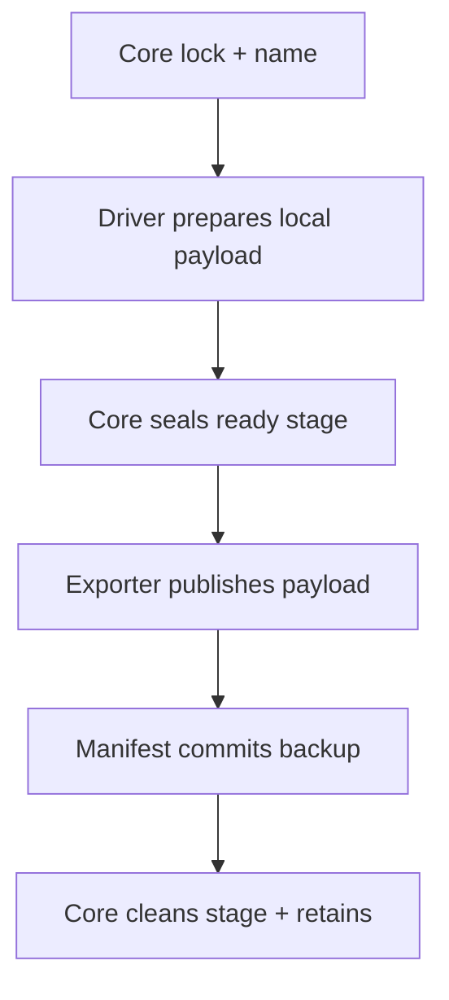

# Backmaster

Backmaster is a fleet-oriented backup orchestrator with three independent
layers:

| Layer | Owns | Does not own |
| --- | --- | --- |
| Core | scheduling, Axon/Myelin fallback, Consul locking, naming, staging | database consistency or cloud APIs |
| Driver | consistent local backup production | credentials, upload, catalogue, retention |
| Exporter | durable publication, remote catalogue, retention | PostgreSQL, MongoDB, mail semantics |

PostgreSQL is the first driver. The bundled rclone exporter targets Azure Blob
today, but can target another rclone backend through configuration or be
replaced with another exporter.

## Staging cycle

Backmaster builds each backup below `STAGING_ROOT/INSTANCE` as a partial stage.
The driver writes only `payload/`; the core adds checksums and a JSON manifest,
then promotes the directory to `*.ready`. The exporter uploads the manifest
last as the remote commit marker. Local data is deleted only after publication
succeeds.

A failed export leaves the ready stage in place. The next run resumes that
export before creating another backup. This bounds normal local usage to one
compressed backup plus small metadata and avoids `/mnt/data` entirely.



## PostgreSQL flow

The PostgreSQL driver uses `pg_basebackup` against node-local port 5431. It
creates compressed tar archives with streamed WAL, so every base backup is
self-contained. Continuous WAL is archived through the exporter's generic
object interface for point-in-time recovery; the driver contains no Azure or
rclone configuration.

Axon attempts first, Myelin uses a delayed timer, remote manifest freshness
decides fallback, and the Consul lock prevents overlap. PostgreSQL 18 supports
base backups from a suitably configured standby, so both nodes can produce the
same flow.

## Naming

| `BACKUP_NAME_MODE` | Example |
| --- | --- |
| `daily` | `2026-08-02` |
| `daily-serial` | `2026-08-02-001` |
| `daily-time` | `2026-08-02T151423Z` |

`BACKUP_NAME_SUFFIX_MODE` is `none`, `hostname`, or `custom`. A custom suffix
uses `BACKUP_NAME_SUFFIX_VALUE`. Naming is UTC and serial lookup belongs to the
exporter catalogue, not the data driver.

## Layout

```text
bin/backmaster                 generic lifecycle and staging
drivers/postgres/driver       local PostgreSQL archive producer
exporters/rclone/exporter     remote storage and retention
config/                       instance, driver, and exporter examples
systemd/                      reusable service/health templates
deploy/{axon,myelin}/         staggered timer examples
docs/                         contracts and recovery runbook
```

The Debian package installs runtime files under `/usr/lib/backmaster`,
configuration under `/etc/backmaster`, and the CLI at `/usr/bin/backmaster`.
The PostgreSQL systemd drop-in runs the
flow as `postgres`; exporter secrets should be `0640 root:postgres`.

```bash
curl -fsSL https://packages.nodsoft.net/install.sh | sudo bash
sudo apt install backmaster
```

Release and branch builds also publish a downloadable `.deb` workflow
artifact. Build one locally with `packaging/build-deb.sh`; set `VERSION` and
`ARCH` to override the detected values.

```bash
sudo -u postgres backmaster connectivity nsys-postgres
sudo -u postgres backmaster run nsys-postgres --force
sudo -u postgres backmaster health nsys-postgres
```

See [driver and exporter development](docs/drivers.md) and the
[PostgreSQL restore runbook](docs/postgres-restore.md). Do not consider a flow
production-ready until an isolated restore drill passes.
