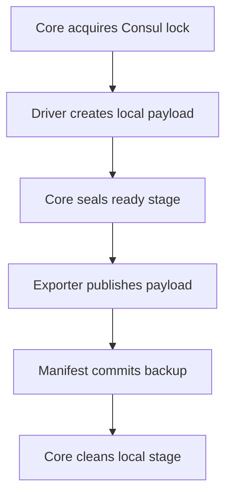

# Backmaster

Backmaster is a modular, fleet-oriented backup orchestrator. A **driver** creates
a consistent local backup, an **exporter** publishes it, and the core coordinates
naming, staging, distributed locking, fallback, retention, and health checks.

PostgreSQL is the first bundled driver. Exporters are available for Microsoft's
AzCopy and for rclone; adding MongoDB, mail, or a new storage service does not
require changing the core.

## Start here

| If you want to… | Read |
| --- | --- |
| Install Backmaster | [Installation](docs/guides/installation.md) |
| Configure an instance | [Configuration reference](docs/guides/configuration.md) |
| Protect and rotate credentials | [Secrets and credentials](docs/guides/secrets.md) |
| Back up PostgreSQL/Patroni | [PostgreSQL driver](docs/drivers/postgresql.md) |
| Configure Azure Blob or another destination | [rclone exporter](docs/exporters/rclone.md) |
| Use Microsoft's Azure-native transfer tool | [AzCopy exporter](docs/exporters/azcopy.md) |
| Schedule, monitor, and maintain backups | [Operations guide](docs/guides/operations.md) |
| Restore PostgreSQL or perform PITR | [PostgreSQL restore runbook](docs/guides/postgres-restore.md) |
| Diagnose a failure | [Troubleshooting](docs/guides/troubleshooting.md) |
| Write a driver | [Driver contract](docs/drivers/index.md) |
| Write an exporter | [Exporter contract](docs/exporters/index.md) |

## Five-minute overview

Install the complete bundled flow after configuring the Nodsoft APT repository:

```bash
sudo apt update
sudo apt install backmaster
```

The `backmaster` metapackage installs:

| Package | Purpose |
| --- | --- |
| `backmaster-core` | CLI, lifecycle, staging, and systemd units |
| `backmaster-driver-postgres` | Physical/WAL and logical PostgreSQL backups |
| `backmaster-exporter-rclone` | Azure Blob and other rclone destinations |
| `backmaster` | Convenience metapackage for all three components |

Azure-only deployments may install `backmaster-exporter-azcopy` instead of the
rclone package. The `backmaster` metapackage retains rclone as its default
exporter for backward-compatible upgrades.

Create three configuration files for an instance named `production-postgres`:

```text
/etc/backmaster/instances.d/production-postgres.env
/etc/backmaster/drivers/postgres/production-postgres.env
/etc/backmaster/exporters/rclone/production-postgres.env
```

Put storage credentials in a separate file:

```text
/etc/backmaster/secrets/production-postgres-exporter.env
```

See [Secrets and credentials](docs/guides/secrets.md) for file precedence,
ownership, permissions, managed identities, validation, and rotation.

Then validate both ends and make an intentional first backup:

```bash
sudo -u postgres backmaster connectivity production-postgres
sudo -u postgres backmaster run production-postgres --force
sudo -u postgres backmaster health production-postgres
```

Do not enable an unattended timer until those commands succeed and an isolated
restore drill has passed.

## How a backup moves



The driver can only write to `payload/`. The core adds checksums and a JSON
manifest, then atomically promotes the stage to `*.ready`. The exporter uploads
the manifest last, making it the remote commit marker. If export fails, the
ready stage stays local and is resumed before any new backup is created.

By default, stages live below `/var/lib/backmaster/INSTANCE`; Backmaster has no
dependency on `/mnt/data`.

## Fleet fallback

Install the same instance on every node capable of producing it. Give all nodes
the same `INSTANCE_NAME`, destination, freshness threshold, and Consul lock key,
but a distinct `NODE_NAME`.

A preferred node runs first. A fallback node runs later and consults the shared
remote catalogue. If a fresh completed backup already exists, it exits without
creating another one. If not, it acquires the same Consul lock and proceeds.
The included Axon/Myelin examples schedule attempts at 02:15 and 03:15 UTC.

## Backup names

All names use UTC:

| `BACKUP_NAME_MODE` | Example |
| --- | --- |
| `daily` | `2026-08-02` |
| `daily-serial` | `2026-08-02-001` |
| `daily-time` | `2026-08-02T151423Z` |

`BACKUP_NAME_SUFFIX_MODE` accepts `none`, `hostname`, or `custom`. With a custom
suffix of `axon`, a serial name becomes `2026-08-02-001-axon`. Serial allocation
comes from the shared exporter catalogue while the Consul lock is held.

## CLI

```text
backmaster run INSTANCE [--force]
backmaster health INSTANCE
backmaster connectivity INSTANCE
backmaster driver INSTANCE VERB [ARG...]
backmaster exporter INSTANCE VERB [ARG...]
backmaster --version
```

`run` skips creation when the exporter reports a fresh completed backup.
`--force` bypasses only that freshness decision; it does not bypass locking,
staging safety, or retention.

## Safety model

- Credentials stay outside instance, driver, and exporter policy files.
- A remote backup is complete only when its `manifest.json` exists.
- Local staging is deleted only after successful publication.
- Retention always preserves `MINIMUM_REDUNDANCY` newest completed backups.
- PostgreSQL physical mode supports WAL/PITR; logical mode supports per-database
  selection.
- Backups are not proven until restore drills are automated and monitored.
