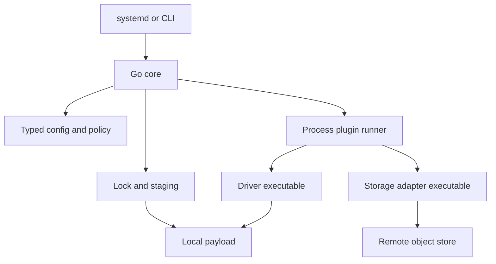
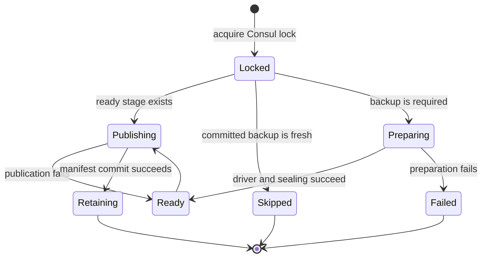

# Architecture: gradual migration from Shell to Go

**Status:** Proposed  
**Last updated:** 2026-08-14

## Decision summary

Backmaster will migrate its orchestration core from Bash to Go incrementally.
The Go core will own configuration and validation, orchestration, locking,
staging, manifests, checksums, archive creation, retention policy, and health
and telemetry policy.

Drivers and exporters will remain out-of-process executables. The boundary is
language-agnostic: a plugin may be written in Shell, Go, or another language as
long as it implements the executable contract. Backmaster will not use Go's
`plugin` package or require plugins to be compiled into the core.

The current executable contract becomes protocol v1. The Go core must run the
existing Shell drivers and exporters unchanged before it becomes the default.
Shell plugin support has no removal milestone in this plan. A future protocol
may require an existing plugin to be adapted, but that adaptation may itself be
written in Shell. Removing Shell compatibility requires a separate decision,
migration path, and release policy.

The migration is complete only after the Go core passes behavior-parity,
failure-recovery, upgrade, rollback, and real restore tests. It is not a
big-bang rewrite of the core and all bundled plugins.

## Context

The current Bash core already has a useful architectural seam:

- `/usr/bin/backmaster` owns the CLI and orchestration;
- drivers are executables at `/usr/lib/backmaster/drivers/DRIVER/driver`;
- exporters are executables at
  `/usr/lib/backmaster/exporters/EXPORTER/exporter`;
- instance configuration selects one driver and one exporter;
- the core passes commands, arguments, paths, and environment variables across
  the process boundary;
- the manifest is the remote commit marker and is published last.

This separation lets the core move to Go without changing how a backup source
or storage provider is implemented. It also avoids the version coupling,
platform constraints, and process-wide failure modes of dynamically loaded Go
plugins.

The main problems to address are concentrated in the core and in policy that is
currently repeated by exporters: Shell state and error handling become harder
to reason about as orchestration grows, configuration is weakly typed, and
catalogue, freshness, serial allocation, and retention policy can diverge
between storage implementations.

## Goals

- Preserve the current CLI, configuration locations, package names, systemd
  units, staging layout, remote layout, and safety invariants during migration.
- Run existing Shell drivers and exporters from the Go core without rewriting
  them in the first migration stages.
- Keep plugin implementation language independent, including continued support
  for Shell executables.
- Move cross-cutting policy into typed, testable Go packages.
- Make cancellation, timeouts, errors, manifests, and state transitions
  explicit.
- Permit drivers, exporters, and core subsystems to migrate independently.
- Make every phase deployable, observable, and reversible.

## Non-goals

- Rewriting every bundled plugin in Go.
- Deprecating Shell plugins as part of the core migration.
- Changing the database backup formats or restore runbooks.
- Changing the remote catalogue or manifest-last commit rule.
- Introducing a daemon, network RPC protocol, or central control plane.
- Treating the plugin process boundary as a sandbox for untrusted code.
- Running Bash and Go backup flows concurrently for the same instance as a
  comparison mechanism; both flows have side effects.

## Architectural decisions

### 1. The core is a Go binary

The final `/usr/bin/backmaster` entry point is a Go binary. Its public commands
remain:

```text
backmaster run INSTANCE [--force]
backmaster health INSTANCE
backmaster connectivity INSTANCE
backmaster driver INSTANCE VERB [ARG...]
backmaster exporter INSTANCE VERB [ARG...]
backmaster --version
```

Internally, the binary is divided into packages with narrow responsibilities:

<!-- markdownlint-disable MD013 -->
| Area | Go responsibility |
| --- | --- |
| Configuration | Parse the documented environment-file subset into typed structs and validate it |
| Orchestration | Execute the backup state machine and resume interrupted work |
| Locking | Preserve the current Consul lock key, timeout, name, and child-exit semantics |
| Plugin runner | Discover executables, construct a minimal environment, run commands, capture results, and propagate cancellation |
| Staging | Create private partial stages, seal them, promote them atomically, and clean them safely |
| Integrity | Produce checksums and supported archive layouts |
| Manifest | Read legacy manifests and read/write schema 2 during compatibility phases |
| Catalogue | Model committed backups independently of a storage implementation |
| Policy | Naming, freshness, serial allocation, retention, and health evaluation |
| Observability | Stable structured fields, durations, exit classification, and metrics hooks |
<!-- markdownlint-enable MD013 -->

### 2. Plugins remain executable processes

The core discovers and executes plugins through the existing installation
paths. Executability and the protocol contract, not filename extensions or
implementation language, determine compatibility. A Shell plugin keeps its
shebang and its own runtime dependency; a Go plugin can be a static binary.

The process boundary provides:

- independent plugin releases and Debian packages;
- crash and dependency isolation from the core process;
- compatibility across implementation languages;
- a straightforward test harness; and
- a stable path for local or third-party plugins.

The core will not import plugin implementation packages and will not use Go
dynamic plugins.

### 3. Protocol v1 is frozen before replacement work

Protocol v1 is the behavior implemented today. The migration must first turn
it into a versioned contract and test suite, without changing it.

#### Driver v1

| Invocation | Required behavior |
| --- | --- |
| `prepare PAYLOAD_DIR` | Produce a self-contained backup inside the supplied empty directory |
| `connectivitycheck` | Validate access to the source and required local tools |
| `healthcheck` | Validate source-specific backup readiness |

The core provides `BACKUP_NAME` and the existing instance environment. A driver
must not write outside its supplied payload directory except for documented
transient work, and it must not implement remote catalogue or retention policy.

#### Exporter v1

| Invocation | Required behavior |
| --- | --- |
| `latest-epoch` | Print the newest committed manifest epoch; exit 3 for an empty catalogue |
| `next-serial DATE` | Print the next positive serial for the UTC day |
| `publish STAGE_DIR` | Publish the stage durably and publish `manifest.json` last |
| `retain` | Apply remote retention after a successful publish |
| `connectivitycheck` | Validate destination authentication and access |
| `healthcheck` | Validate remote backup freshness |
| `put-file SOURCE KEY` | Optionally publish a continuous-recovery object |
| `get-file KEY DESTINATION` | Optionally retrieve a continuous-recovery object |

For v1 query verbs, stdout is machine-readable output and diagnostics go to
stderr. Exit 0 means success, exit 3 retains its existing empty-catalogue
meaning for `latest-epoch`, exit 64 means invalid usage where already used, and
other non-zero statuses are failures. Exact arguments, environment variables,
working-directory assumptions, signals, and stdout rules must be captured in
contract tests before the Go runner is considered compatible.

The Go core initially treats v1 exporters as policy-bearing legacy adapters.
This preserves the bundled rclone and AzCopy Shell exporters unchanged.

### 4. Shared exporter policy moves to the core behind a new adapter contract

The target architecture separates storage mechanics from backup policy.
Freshness, committed-manifest discovery, next-serial calculation, retention,
and health evaluation become one Go implementation. Exporters become storage
adapters responsible for authentication and object operations.

The adapter protocol will remain executable and language-agnostic. Its detailed
wire specification must be approved before implementation, but it must provide
the capabilities needed to:

- list objects under an exporter-owned prefix with stable pagination and
  metadata;
- upload, download, and delete an object;
- delete a backup prefix safely when the backend supports it;
- report capabilities and protocol version; and
- check destination connectivity.

Machine-readable results will use a versioned JSON or JSON Lines schema rather
than parsing human output. Object keys remain relative to an exporter-owned
namespace. The core continues to upload all payload objects before the manifest
commit marker.

Existing v1 exporters remain available through a `LegacyExporter` interface
while storage adapters are introduced. A storage adapter can be implemented in
Shell; moving policy into Go does not make Go mandatory for exporters.

### 5. Compatibility is semantic, not byte-for-byte

The Go core must preserve these external behaviors:

- instance files remain under `/etc/backmaster/instances.d`;
- current keys, defaults, validation rules, and file precedence remain valid;
- driver, exporter, and secret paths continue to be passed to plugins;
- stages remain under `STAGING_ROOT/INSTANCE` and use partial and `*.ready`
  states;
- a failed export leaves the ready stage for the next locked run;
- no new backup is created while a ready stage is pending;
- `--force` bypasses only the freshness decision;
- manifest schema 2 and legacy files-layout manifests remain readable;
- files and archive stage layouts remain publishable;
- the manifest remains the remote commit marker;
- local staging is removed only after successful publication;
- the existing systemd user, hardening, paths, and state-directory behavior
  remain valid.

JSON key order, log timestamp formatting, and other representations do not need
to be byte-identical unless a contract test proves that an external consumer
depends on them.

## Target architecture



The core owns the transaction. Plugins perform source-specific or
destination-specific work but do not decide the global lifecycle.

### Backup state machine



On successful publication, the core removes the local ready stage before or as
part of entering retention, matching the current externally observable order.
Retention failure is reported, but it must never make an already committed
backup appear uncommitted.

## Configuration strategy

Go uses typed internal structures without forcing an immediate configuration
format change. The instance-file parser supports the documented, declarative
subset used by packaged examples: comments, blank lines, `KEY=value`
assignments, and documented quoting and escaping. It must not execute command
substitution, shell functions, redirects, or arbitrary commands.

Before rollout, a compatibility checker will scan deployed instance files and
report constructs outside that subset. The Bash core remains the rollback path
until all selected instances pass the checker or have been rewritten into the
supported declarative form.

In the v1 compatibility phases, driver and exporter configuration remains
plugin-owned. The core passes `DRIVER_CONFIG`, `DRIVER_SECRET_FILE`,
`EXPORTER_CONFIG`, and `EXPORTER_SECRET_FILE`; existing Shell plugins continue
to load those files themselves. The core must not log secret values or include
the ambient service environment wholesale when a minimal explicit environment
is sufficient.

## Manifest and storage compatibility

The Go manifest writer initially emits schema 2 with the current fields:

- `schema`, `backup_name`, `instance`, `driver`, `node`, and `created_epoch`;
- `artifact.layout=files`; or
- `artifact.layout=archive` with `format`, `file`, `compression_level`, and
  `sha256`.

Readers must continue accepting legacy manifests without `artifact`, treating
them as the files layout. Schema changes must be additive while old exporters
remain deployed. A schema 3 writer must not ship until every supported reader
and exporter can safely consume it, and its rollout and rollback behavior are
tested against existing remote catalogues.

Storage keys and commit semantics do not change during the core migration:

```text
basebackups/BACKUP_NAME/...payload or archive objects...
basebackups/BACKUP_NAME/manifest.json   # uploaded last
objects/...continuous recovery objects...
```

## Repository and package shape

The expected Go layout is:

```text
cmd/backmaster/                 CLI entry point
internal/config/                instance parsing and validation
internal/orchestrator/          backup state machine
internal/lock/                  Consul integration
internal/stage/                 local transaction and archive handling
internal/manifest/              schema models and compatibility
internal/plugin/                process runner and v1 contracts
internal/catalogue/             committed backup model and policy
protocol/                       executable protocol specifications and fixtures
```

The exact package boundaries may evolve, but dependencies should point inward:
orchestration depends on interfaces, while Consul, filesystem, clock, command,
and storage implementations sit at the edges.

Debian package names remain `backmaster-core`, `backmaster-driver-*`,
`backmaster-exporter-*`, and the `backmaster` metapackage. Existing plugin
install paths remain stable. When the Go core no longer needs Bash, the core
package may drop its Bash dependency; each Shell plugin package continues to
declare Bash itself. The systemd `ExecStart`, user, state directory, and
hardening remain unchanged at the default cutover.

## Migration plan

### Phase 0: freeze behavior and build the safety net

1. Publish protocol v1 as a normative specification.
2. Add a fake driver and fake exporter for deterministic integration tests.
3. Capture golden fixtures for configuration defaults, names, stages,
   checksums, schema 2 manifests, legacy manifests, logs, and exit statuses.
4. Add failure injection for lock contention, driver failure, partial archive
   creation, exporter failure before and after payload upload, retention
   failure, cancellation, and process termination.
5. Record restore results for each bundled driver and each stage layout.

**Exit gate:** the Bash implementation passes the new contract suite, so the
suite describes real behavior rather than an aspirational replacement.

### Phase 1: introduce the Go skeleton

1. Add the Go module, CLI parser, version reporting, typed configuration, and
   plugin process runner.
2. Implement `driver` and `exporter` pass-through commands first.
3. Run existing bundled Shell plugins unchanged in CI.
4. Build a separate `backmaster-go` canary binary while `/usr/bin/backmaster`
   remains the Bash implementation.

**Exit gate:** CLI, configuration, environment, exit-code, signal, and plugin
contract tests pass on all supported Debian architectures.

### Phase 2: move orchestration to Go behind opt-in canaries

1. Implement locking, freshness, naming, staging, checksums, archive creation,
   schema 2 manifests, publication, resume, and retention sequencing.
2. Continue using v1 Shell drivers and exporters without modification.
3. Canary one instance at a time. Never run Bash and Go flows concurrently for
   the same instance merely to compare results.
4. Compare non-mutating plans and fixture results, then validate real canary
   backups with isolated restores.

**Exit gate:** parity and failure-recovery tests pass, and every bundled
driver/exporter combination selected for support has produced and restored a
Go-orchestrated backup.

### Phase 3: make the Go core the default with rollback available

1. Install the Go binary at `/usr/bin/backmaster` without changing systemd
   units, paths, package names, or plugin discovery.
2. Retain the previous Bash core at a compatibility path for at least one
   supported release line and document a package-level rollback procedure.
3. Roll out by fleet cohort and monitor lock duration, stage age, publish
   duration, retention errors, and backup freshness.

**Exit gate:** the fleet completes the agreed soak period with no unexplained
manifest, locking, staging, or restore regressions.

### Phase 4: centralize exporter policy

1. Approve the versioned storage-adapter protocol and capability model.
2. Implement catalogue, freshness, serial, retention, and remote-health policy
   once in Go.
3. Add a process adapter for at least one backend while retaining
   `LegacyExporter` for v1 exporters.
4. Prove that Go policy produces the same decisions over captured rclone and
   AzCopy catalogue fixtures.

**Exit gate:** mixed fleets can use v1 exporters and new storage adapters
without changing remote layouts or committed-backup semantics.

### Phase 5: rewrite plugins selectively

Rewrite a driver or exporter only when it delivers a concrete benefit such as
removing duplicated policy, improving streaming behavior, reducing runtime
dependencies, or making failure handling testable. Rewrites are independent;
a Go driver may run with a Shell storage adapter and a Shell driver may run with
a Go storage adapter.

Bundled Shell plugins may be adapted to newer executable contracts in Shell or
rewritten in Go. Third-party Shell plugins remain supported when they implement
a supported protocol version. No phase requires all plugins to use Go.

### Phase 6: retire the Bash core by a separate decision

The Bash **core** can be removed after supported releases, rollback windows,
and restore evidence satisfy the project's release policy. This does not remove
the executable plugin boundary or Shell plugin support. Any later proposal to
remove a protocol version or Shell compatibility must be evaluated separately.

## Verification matrix

CI and release qualification must cover these combinations while they are
supported:

| Core | Driver | Exporter | Purpose |
| --- | --- | --- | --- |
| Bash | v1 Shell | v1 Shell | Regression baseline until Bash-core retirement |
| Go | v1 Shell | v1 Shell | Mandatory compatibility path for initial cutover |
| Go | v1 or newer executable | v1 Shell | Independent driver migration |
| Go | v1 Shell | storage adapter | Independent exporter migration |
| Go | newer executable | storage adapter | Target architecture |

For each relevant row, tests must cover PostgreSQL and MongoDB drivers, rclone
and AzCopy destinations where available, files and every supported archive
format, empty and populated catalogues, daily naming modes, resume from a ready
stage, interrupted publication, retention limits, health checks, and direct
driver/exporter pass-through commands.

Release gates require an isolated restore, not merely a successful backup
command. PostgreSQL qualification includes the supported physical, logical,
and WAL/PITR paths. MongoDB qualification includes complete and selective
restores for supported dump formats.

## Observability and operational safety

The Go core retains stable log fields such as `instance`, `node`, `action`,
`driver`, `exporter`, `backup_name`, and `stage`. New fields may include
`protocol_version`, `duration_seconds`, `exit_code`, and a stable error class.
Secret values and credential-bearing URLs must be redacted.

Operators need visibility into:

- lock acquisition and wait time;
- pending ready-stage age;
- driver, sealing, and publication duration;
- last committed backup age;
- retention decisions and failures;
- plugin protocol and implementation version; and
- rollback selection during the compatibility window.

A health check must distinguish source failure, destination failure, stale or
empty catalogue, pending local stage, and protocol failure without changing
existing successful command semantics during compatibility phases.

## Rollback rules

- A Go release must read every stage and manifest written by the previous
  supported Bash release.
- The retained Bash compatibility core must be able to resume a ready stage
  written by the Go core while rollback is supported.
- No release may write a new stage or manifest shape before the rollback reader
  understands it.
- Package rollback must not overwrite administrator-owned configuration below
  `/etc/backmaster`.
- Rollback does not delete remote objects or local stages automatically.
- If publication status is ambiguous, operators preserve the stage and inspect
  the remote manifest rather than rerunning the driver.

## Risks and mitigations

<!-- markdownlint-disable MD013 -->
| Risk | Mitigation |
| --- | --- |
| Go parses `.env` files differently from Bash | Define the declarative subset, scan deployed files, and use a shared fixture corpus |
| Lock behavior changes during replacement | Preserve current Consul semantics first; test contention, timeout, cancellation, and child exit before changing the implementation |
| Error handling deletes recoverable state | Model stage transitions explicitly and inject failures at every filesystem and plugin boundary |
| Exporter policy diverges during coexistence | Treat v1 exporters as legacy policy-bearing adapters and compare decisions against captured catalogues before centralization |
| A manifest or remote-layout change breaks restore or rollback | Keep schema 2 and manifest-last semantics through cutover; require forward/backward fixtures and restores |
| Process cancellation leaves child processes running | Use process groups, signal propagation, bounded shutdown, and tests for grandchildren |
| Secrets leak through logs or inherited environment | Construct a minimal explicit environment, redact known secret fields, and test logs |
| Packaging silently makes Shell impossible | Keep executable discovery language-neutral and declare runtime dependencies in each plugin package |
| A big-bang rewrite hides regressions | Ship independently gated phases and rewrite plugins only after Go-core compatibility is proven |
<!-- markdownlint-enable MD013 -->

## Consequences

This design accepts temporary duplication: Go and Bash cores coexist, and v1
exporters retain policy while the Go implementation is proven. That cost buys a
reversible migration and allows production restore evidence to accumulate
before each ownership boundary moves.

The long-term result is a typed Go policy and orchestration core with small,
replaceable source and storage executables. Shell remains a valid plugin
implementation language, while individual bundled plugins can be rewritten on
their own merits rather than as a prerequisite for the core migration.
